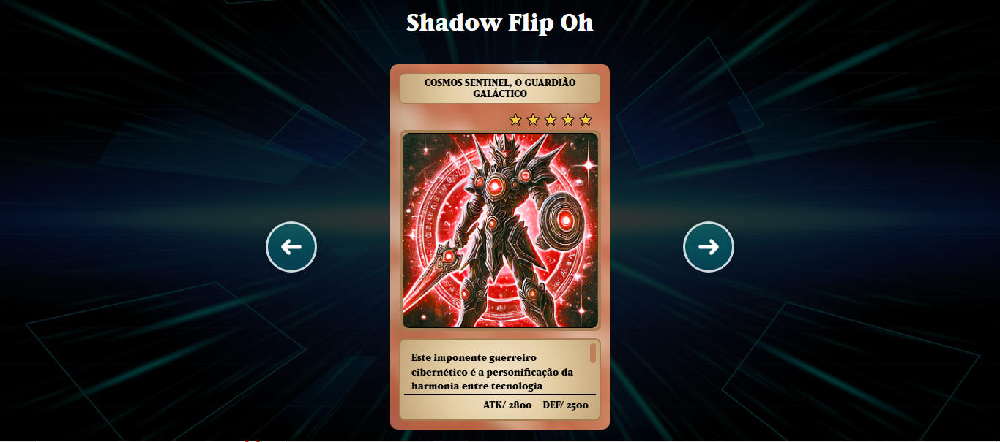

<h2 id="sobre-o-projeto">1. 🎮 Sobre o Projeto</h2>


[](https://github.com/Domisnnet/Shadow-Flip-Oh-Vue.Js/edit/main/LICENSE)



Shadow-Flip-Oh-Vue é um jogo da memória inspirado em Yu-Gi-Oh!, desenvolvido com Vue.js e Vite. Pode ser usado para criar interfaces dinâmicas e envolventes.

> 💡 Uma combinação entre **frontend moderno** e **nostalgia dos duelos de cartas**.

---

## 📚 Tabela de Conteúdo

| 🎮 O Jogo | 🛠️ Técnico | 🤝 Comunidade |
| :---: | :---: | :---: |
| [](#1-sobre-o-projeto) | [](#5-instalação-e-execução-local) | [](#8-perguntas-frequentes) |
| [](#2-tecnologias-utilizadas) | [](#6-implantação) | [](#9-licença) |
| [](#3-como-jogar) | [](#7-contribuindo-para-o-projeto) | [](#10-conclusão) |
| [](#4-regras-do-jogo) | | |

---

<h2 id="2-tecnologias-utilizadas">2. ⚙️ Tecnologias Utilizadas</h2>

| Camada | Tecnologias | Descrição |
| :--- | :--- | :--- |
| **Frontend** |   | Framework reativo e build otimizado. |
| **Estado/Rotas** |   | Gerenciamento de estado e navegação. |

---

<h2 id="3-como-jogar">3. 🚀 Como Jogar</h2>

| Passo | Ação |
| :---: | :--- |
| **1** | Acesse um dos links na seção de implantação. |
| **2** | Clique em uma carta para revelá-la. |
| **3** | Encontre o par correspondente para marcar pontos. |
| **4** | Complete o tabuleiro para vencer o duelo! |

---

<h2 id="4-regras-do-jogo">4. 🧩 Regras do Jogo</h2>

* 🔹 **Virar:** Clique em uma carta para virá-la.
* 🔹 **Match:** Se as cartas coincidirem, permanecem viradas.
* 🔹 **Erro:** Caso contrário, voltam à posição inicial após 1 segundo.
* 🏆 **Vitória:** O jogo termina quando todos os pares forem encontrados.

---

<h2 id="5-instalação-e-execução-local">5. 🛠️ Instalação e Execução Local</h2>

```bash
# Clone o repositório
git clone [https://github.com/Domisnnet/Shadow-Flip-Oh-Vue.git](https://github.com/Domisnnet/Shadow-Flip-Oh-Vue.Js.git)

# Instale e rode
cd Shadow-Flip-Oh-Vue.Js
npm install
npm run dev

# 💻 Execução Local

O jogo ficará disponível em [http://localhost:5173](http://localhost:5173)  
> ⚠️ Observação: a porta pode variar dependendo do ambiente.
```

---

<h2 id="implantacao">6. 🌐 Implantação</h2>

O projeto está disponível para jogar online nos seguintes links:

| Plataforma | Status | Link de Acesso direto para o Jogo: |
| :--- | :---: | :--- |
| **GitHub Pages** |  | [](https://domisnnet.github.io/Shadow-Flip-Oh-Vue.Js/) |
| **Firebase Hosting** |  | [](https://shadow-flip-oh-86570817-f8cc4.web.app) |

---

<h2 id="como-contribuir">7. 🤝 Contribuindo para o Projeto</h2>

Adicione este projeto ao seu "deck" de desenvolvedor! Siga a jornada abaixo para fortalecer este projeto:
“O coração das cartas também guia os contribuidores!” 🃏

| Fase | Ação | Link / Comando |
| :---: | :--- | :--- |
| **01** | **Prepare o Terreno** | [](https://github.com/Domisnnet/Shadow-Flip-Oh-Vue.Js/fork) |
| **02** | **Crie uma Branch** | `git checkout -b feature/NovaMelhoria` |
| **03** | **Guarde as Mudanças** | `git commit -m 'feat: Adiciona nova funcionalidade'` |
| **04** | **Envie o Código** | `git push origin feature/NovaMelhoria` |
| **05** | **Desafio Final** | [](https://github.com/Domisnnet/Shadow-Flip-Oh-Vue.Js/compare) |


### 🐛 Encontrou um problema?
Se algo não estiver funcionando como esperado, não hesite em abrir um chamado:

[](https://github.com/Domisnnet/Shadow-Flip-Oh-Vue.Js/issues)
[](https://github.com/Domisnnet/Shadow-Flip-Oh-Vue.Js/issues/new)

---

<h2 id="8-perguntas-frequentes">8. 🧠 Perguntas Frequentes</h2>

<details>
<summary><strong>O que é o Shadow-Flip-Oh-Vue ❓</strong></summary>
<p>🃏 <strong>Resposta:</strong> É um jogo de cartas da memória com estética inspirada no universo de Yu-Gi-Oh!, desenvolvido com <strong>Vue.js</strong> e <strong>Vite</strong> para demonstrar interfaces reativas e performáticas.</p>
</details>

<details>
<summary><strong>É possível jogar online ❓</strong></summary>
<p>✅ <strong>Sim!</strong> O duelo já está disponível. Você pode acessar os links de hospedagem diretamente na seção de: <p>🌐 <strong>Implantação.
</strong></p>
</details>

<details>
<summary><strong>Como atualizar as versões publicadas (deploy) ❓</strong></summary>
<p>O projeto suporta dois ambientes. Para o deploy correto, ajuste o arquivo <code>vite.config.ts</code>:</p>
<ul>
  <li>🔥 <strong>Firebase Hosting:</strong> <strong>Comente</strong> a linha <code>base: '/Shadow-Flip-Oh-Vue/'</code>, rode <code>npm run build</code> e faça o deploy da pasta <code>dist</code>.</li>
  <li>🐙 <strong>GitHub Pages:</strong> <strong>Descomente</strong> a linha <code>base</code> e execute o script <code>./deploy.sh</code>.</li>
</ul>
</details>

<details>
<summary><strong>Posso contribuir com o projeto ❓</strong></summary>
<p>Claro! O "coração das cartas" guia os contribuidores. Basta seguir nosso guia e abrir um <strong>Pull Request</strong> para fortalecer este deck:</p>
<a href="https://github.com/Domisnnet/Shadow-Flip-Oh-Vue.Js/compare">
  
</a>
</details>

---

<h2 id="codigo-fonte">9. 💻 Código Fonte</h2>

Gostou do jogo? Explore o código ou faça sugestões:

[](https://github.com/Domisnnet/Shadow-Flip-Oh-Vue.js)

---

<h2 id="creditos">10. 📝 Créditos</h2>

* **Desenvolvedor 👨‍💻: DomisDev**.

---

<h2 id="licenca">11. 📄 Licença</h2>

Este projeto é *open source* e está licenciado sob a [](https://github.com/Domisnnet/Shadow-Flip-Oh-Vue.Js/edit/main/LICENSE)


---

<h2 id="conclusao"12. 📝 Conclusão e Perfil

O **Shadow-Flip-Oh-Vue** combina nostalgia, interatividade e aprendizado.  
Explore, contribua e divirta-se criando sua própria versão do duelo de memória digital!

> ✨ *“Cada carta virada é uma jogada do destino.”* — Shadow-Flip-Oh!

---

Para conhecer meu Repositório:

<a href="https://github.com/Domisnnet">  </a>